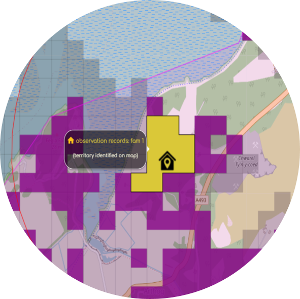
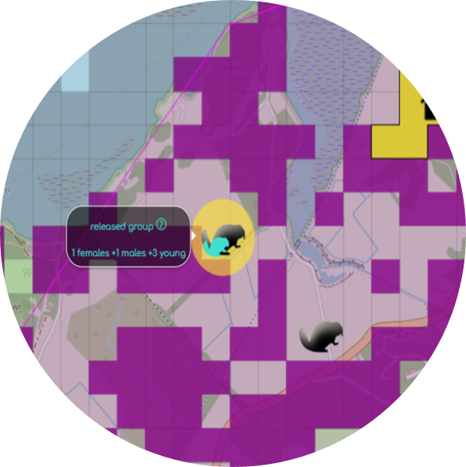
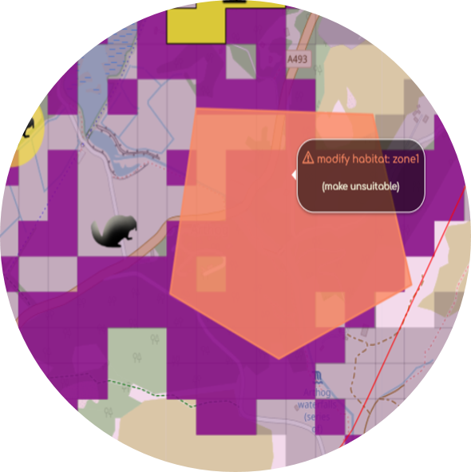
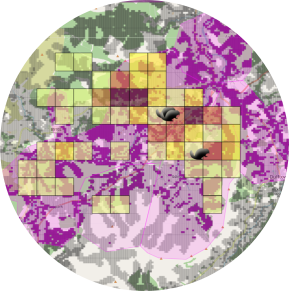
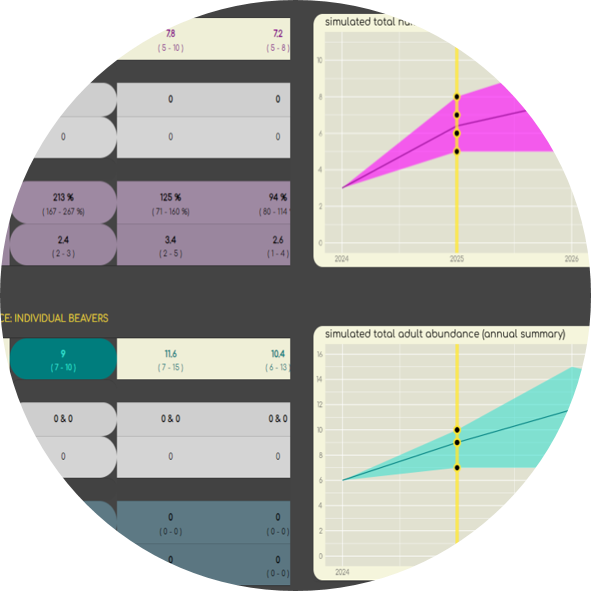
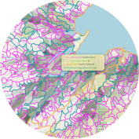

# A Beaver Translocation Simulation App
A shiny App developed by zelda van der Waal at the University of Newcastle (UK) for NatureScot, Natural Resource Wales, the Environment Agency and Natural England in 2024.

## About
As part of a beaver landscape modelling tender Newcastle University produced a desk-based tool to inform future beaver management decision-making with the aim to work with agencies in designing and producing a desk-based tool which applies the beaver population model and informs beaver management decision-making. The app was initially developed using the Beauly catchment (Scotland) as an example. It was extended to cover Scotland, England and Wales in 2024. 

     

In-app documentation includes: 
- instructions (general how to, initial simulation set-up)
- description of the app functionalities (buttons, map legends)
- summary of the assumptions and parameters within the models
- help with output interpretation
- suggestions for further documentation
- literature and packages references     

[link to docu?](https://github.com/zeldavanderwaal/Scotland-Beaver-App/files/10458558/Beaver.app.guidance.-.12.jan.2023.pdf)


### Project Team
Dr Zelda van der Waal, Newcastle University  ([email](mailto:zeldavdwaal@gmail.com))  
Prof Aileen Mill, Newcastle University  ([email](mailto:aileen.mill@newcastle.ac.uk))  


## Built With
R version 4.4.1 (2024-06-14 ucrt) 
RStudio 2024.04.2+764 "Chocolate Cosmos" 
Release (e4392fc9ddc21961fd1d0efd47484b43f07a4177, 2024-06-05) for windows
[Shiny for R](https://shiny.rstudio.com/)  


## Getting Started

### Prerequisites
The code runs in R version 4.4.1. 
Browser versions at the time of deployment:  
Mozilla/5.0 (Windows NT 10.0; Win64; x64) AppleWebKit/537.36 (KHTML, like Gecko) RStudio/2024.04.2+764 Chrome/120.0.6099.291 Electron/28.3.1 Safari/537.36, Quarto 1.4.555

### Installation
No.

### Running Locally
The code can be downloaded to run the application locally in R 4.4.1.
 
 
### Production
Deployed onto www.shinyapps.io/. 

## Usage
Access to url restricted to Agencies. 

### Main Branch
Protected and can only be pushed to via pull requests. Should be considered stable and a representation of production code.

### Dev Branch
Should be considered fragile, code should compile and run but features may be prone to errors.

### Feature Branches
A branch per feature being worked on.

https://nvie.com/posts/a-successful-git-branching-model/

## License
MIT License

Copyright (c) 2024 zeldavanderwaal

Permission is hereby granted, free of charge, to any person obtaining a copy
of this software and associated documentation files (the "Software"), to deal
in the Software without restriction, including without limitation the rights
to use, copy, modify, merge, publish, distribute, sublicense, and/or sell
copies of the Software, and to permit persons to whom the Software is
furnished to do so, subject to the following conditions:

The above copyright notice and this permission notice shall be included in all
copies or substantial portions of the Software.

THE SOFTWARE IS PROVIDED "AS IS", WITHOUT WARRANTY OF ANY KIND, EXPRESS OR
IMPLIED, INCLUDING BUT NOT LIMITED TO THE WARRANTIES OF MERCHANTABILITY,
FITNESS FOR A PARTICULAR PURPOSE AND NONINFRINGEMENT. IN NO EVENT SHALL THE
AUTHORS OR COPYRIGHT HOLDERS BE LIABLE FOR ANY CLAIM, DAMAGES OR OTHER
LIABILITY, WHETHER IN AN ACTION OF CONTRACT, TORT OR OTHERWISE, ARISING FROM,
OUT OF OR IN CONNECTION WITH THE SOFTWARE OR THE USE OR OTHER DEALINGS IN THE
SOFTWARE.


## Citiation 
Please cite the associated papers for this work if you use this code:

```
@article{xxx2024paper,
  title={Title},
  author={Author},
  journal={arXiv},
  year={2024}
}
```


## Acknowledgements
This work was funded by NatureScot, Natural Resource Wales, the Environment Agency and Natural England.
