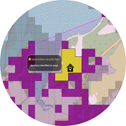
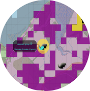
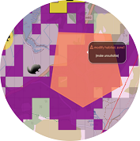
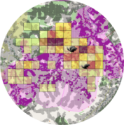
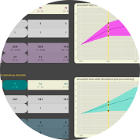
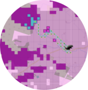

# a Beaver Population Simulation App
A shiny App developed by zelda van der Waal at the University of Newcastle (UK) for NatureScot, Natural Resource Wales, the Environment Agency and Natural England in 2024.

## About
As part of a beaver landscape modelling tender Newcastle University produced a desk-based tool to inform future beaver management decision-making with the aim to work with agencies in designing and producing a desk-based tool which applies the beaver population model and informs beaver management decision-making. The app was initially developed using the Beauly catchment (Scotland) as an example. It was extended to cover Scotland, England and Wales in 2024. 

A demo version is available here:
[a Beaver Population Simulation App - demo! ](https://naturalandenvironmentalscience.shinyapps.io/beaverApp_demo_v1/)

## App functionalities 
   - combine local beaver populations: locate existing beaver territories on the map, simulate translocations
   - landscape: modify habitat quality, incorporate barriers and management scenarios
   - simulate the growth of all local populations across the landscape
   - map probability of occupancy, create summaries over local areas and visualise trends through time
 
    
    

In-app documentation includes
   - instructions (user guide, tutorial videos)
   - description of the app functionalities (buttons, map legends)
   - summary of the assumptions and parameters within the models
   - help with output interpretation
   - suggestions for further documentation
   - literature and packages references     

## The Project Team
Dr Zelda van der Waal, Newcastle University  ([email](mailto:zeldavdwaal@gmail.com)) ([email](mailto:zelda.vanderwaal@ncl.ac.uk)) 
Prof Aileen Mill, Newcastle University  ([email](mailto:aileen.mill@newcastle.ac.uk))  

## Built With
R version 4.4.1 (2024-06-14 ucrt) 
RStudio 2024.04.2+764 "Chocolate Cosmos" 
Release (e4392fc9ddc21961fd1d0efd47484b43f07a4177, 2024-06-05) for windows
[Shiny for R](https://shiny.rstudio.com/)  
Browser versions at the time of deployment:  
Mozilla/5.0 (Windows NT 10.0; Win64; x64) AppleWebKit/537.36 (KHTML, like Gecko) RStudio/2024.04.2+764 Chrome/120.0.6099.291 Electron/28.3.1 Safari/537.36, Quarto 1.4.555
 
   
## Production
Deployed onto www.shinyapps.io/ for agencies  [here is a demo version](https://naturalandenvironmentalscience.shinyapps.io/beaverApp_demo_v1/)
  
## License tbc???
MIT License

Copyright (c) 2024 zeldavanderwaal

Permission is hereby granted, free of charge, to any person obtaining a copy
of this software and associated documentation files (the "Software"), to deal
in the Software without restriction, including without limitation the rights
to use, copy, modify, merge, publish, distribute, sublicense, and/or sell
copies of the Software, and to permit persons to whom the Software is
furnished to do so, subject to the following conditions:

The above copyright notice and this permission notice shall be included in all
copies or substantial portions of the Software.

THE SOFTWARE IS PROVIDED "AS IS", WITHOUT WARRANTY OF ANY KIND, EXPRESS OR
IMPLIED, INCLUDING BUT NOT LIMITED TO THE WARRANTIES OF MERCHANTABILITY,
FITNESS FOR A PARTICULAR PURPOSE AND NONINFRINGEMENT. IN NO EVENT SHALL THE
AUTHORS OR COPYRIGHT HOLDERS BE LIABLE FOR ANY CLAIM, DAMAGES OR OTHER
LIABILITY, WHETHER IN AN ACTION OF CONTRACT, TORT OR OTHERWISE, ARISING FROM,
OUT OF OR IN CONNECTION WITH THE SOFTWARE OR THE USE OR OTHER DEALINGS IN THE
SOFTWARE.

## Citation 
Please cite the associated papers for this work if you use this code:
A Beaver Population Simulation App: A shiny App developed by zelda van der Waal at the University of Newcastle (UK, 2024).
Publication: writing ongoing.

 
## Acknowledgements
This work was funded by NatureScot, Natural Resource Wales, the Environment Agency and Natural England.
